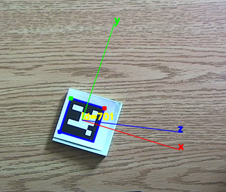

# Pose-Estimation-Aruco-Marker-ROS
6-DoF Pose Estimation using Aruco Markers in ROS



In order to estimate 6-DoF pose of Aruco markers in ROS, we needto follow the following steps,
1. Create ROS workspace
2. Clone usb_cam package
3. Calibrate the camera
4. Clone aruco_ros package
5. Create Aruco marker tracking package
6. Test tracking

Now that we know the basic steps required, we will explain each of the steps one by one.

### Create ROS workspace
The method to create ROS `catkin` workspace is well described in ROS documentation [here](http://wiki.ros.org/catkin/Tutorials/create_a_workspace). However for the completenes we will descrbe the process here as well. Please follow the instruction given below after you open a new terminal,

```
$ source /opt/ros/melodic/setup.bash
$ mkdir -p ~/ros_ws_cam/src
$ cd ~/ros_ws_cam/
$ catkin_make
```
Do not forget to `source` the new `*.sh` file now on every time you open a new terminal.
```
$ source devel/setup.bash
```

### Clone `usb_cam` package
The `usb_cam_node` interfaces with USB camera using libusb_cam and publishes images as `sensor_msgs::Image`. By default it uses `/usb_cam` as namespace to publish all image topics. More specifically a topic name should look like `/usb_cam/topic_name`. Floow the instructions below to install the package locally in your workspace.

```
$ cd ~/ros_ws_cam/src
$ git clone https://github.com/ros-drivers/usb_cam
$ cd ..
$ catkin_make
$ source devel/setup.bash
```
After that we need to connect usb camera to one of the usb port and should run the launch file named `usb_cam-test.launch`. Do not forget to change the value of the parameter `video_device` to `/dev/video1` form `/dev/video0` if you are using a laptop which already has a built-in webcam with it. 

Run the test launch file as,
```
$ roslaunch usb_cam usb_cam-test.launch
```
After running the launch file you should see live image stream from the camera in a new window just opened.

### Calibrate the camera
Before you track a marker, it is very important that you have your camera properly calibrated to obtain meaningful and correct information. The ROS package to perform camera calibration is named as `image_pipeline` which you first need to clone to your local workspace as following,

```
$ cd ~/ros_ws_cam/src
$ git clone https://github.com/ros-perception/image_pipeline
$ cd ..
$ catkin_make
$ source devel/setup.bash
```

As far as camera calibration method is concerned, there are two types available, `monocular` and `stereo`. We will be using only one camera to track a aruco marker, hence we will be interested in `monoculaar camera calibration method` as instructed following. To run the cameracalibrator.py node for a monocular camera using an 8x6 chessboard with 108mm squares: (for details please ckeck [here](http://wiki.ros.org/camera_calibration) and [here](http://wiki.ros.org/camera_calibration/Tutorials/MonocularCalibration))

```
-$ rosrun camera_calibration cameracalibrator.py --size 8x6 --square 0.108 image:=/usb_cam/image camera:=/usb_cam
+$ rosrun camera_calibration cameracalibrator.py --size 8x6 --square 0.108 image:=/usb_cam/image_raw  camera:=/usb_cam

```
### How does the camera calibration works?
https://docs.opencv.org/2.4/modules/calib3d/doc/camera_calibration_and_3d_reconstruction.html


### Clone aruco_ros package
Now we need the package that has `arucofidmarkers` node to detect and estimate pose of a aruco marker. Details about the package can be found [here](http://wiki.ros.org/aruco_ros). However following the instructions below will make you go on further with little effort.

```
$ cd ~/ros_ws_cam/src
$ git clone https://github.com/pal-robotics/aruco_ros
$ cd ..
$ catkin_make
$ source devel/setup.bash
```

### Create Aruco marker tracking package
Create a ROS catkin package named `my_aruco_tracker` following the instructions given in [here](http://wiki.ros.org/ROS/Tutorials/CreatingPackage). Make sure to provide following package names as dependencies while creating ROS package,

```
$ cd ~/ros_ws_cam/src
$ catkin_create_pkg my_aruco_tracker std_msgs sensor_msgs rospy roscpp usb_cam aruco_ros
$ cd ..
$ catkin_make
$ source devel/setup.bash
```
After that copy the launch folder from this repository and put it inside the package. Also replace the `src` folder with the one given here to obtain the node called `write_data.py`. You need to create the executable for this node as following,

```
$ roscd my_aruco_tracker
$ cd src
$ chmod u+x writedata.py
```
Now you are ready to track the aruco markers. At first open 4 new terminals. In the first terminal type in the following,

```
$ cd ~/ros_ws_cam
$ source devel/setup.bash
$ roslaunch my_aruco_tracker usb_cam_stream_publisher.launch
```

In the second terminal type in the following,

```
$ cd ~/ros_ws_cam
$ source devel/setup.bash
$ roslaunch my_aruco_tracker aruco_marker_finder.launch
```
**Note**: change the markerID value as rwquired. Default value is `701`

In the third terminal terminal type in the following,

```
$ cd ~/ros_ws_cam
$ source devel/setup.bash
$ rosrun rqt_gui rqt_gui
```

Once the image gui window opens up, select rostopic */aruco_single/result* from the available rostopics.

If you want to collect data of the maker pose `(x,y,z,qx,qy,qz,qw)` at each time stamp in a `.csv` file run the `writedata.py` node int the fourth terminal,

```
$ cd ~/ros_ws_cam
$ source devel/setup.bash
$ rosrun my_aruco_tracker write_data.py
```
